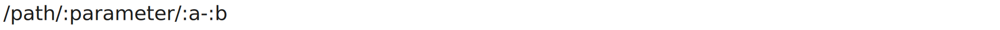

<!-- README.md is generated from README.Rmd. Please edit that file -->

# pater

<!-- badges: start -->

<!-- badges: end -->

The goal of pater is to decompose a given pathname into meaningful
tokens that will be later used to construct a regular expression useful
when matching an HTTP request to a route handler.

Core to this are **path parameters** which are pieces of text you define
in your route handlers, prefixing the name of your parameter with a
colon, and that will be filled when a new request comes in, they are
useful because they act as identifiers for a given concept you care
about.

Path parameters can appear anywhere you want inside a given path, they
may share the same segment as in the following image:



## Installation

You can install the development version of pater like so:

``` r
# install.packages("pak")
# pak::pak("JulioCollazos64/pater")
```
